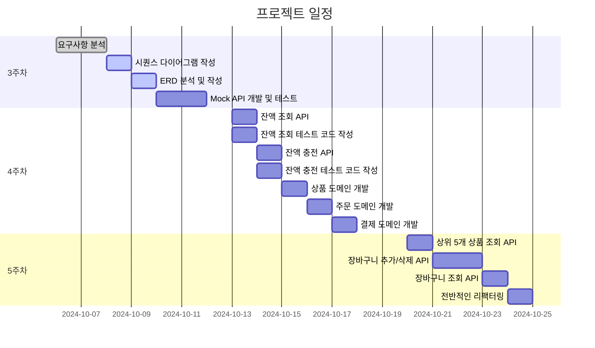
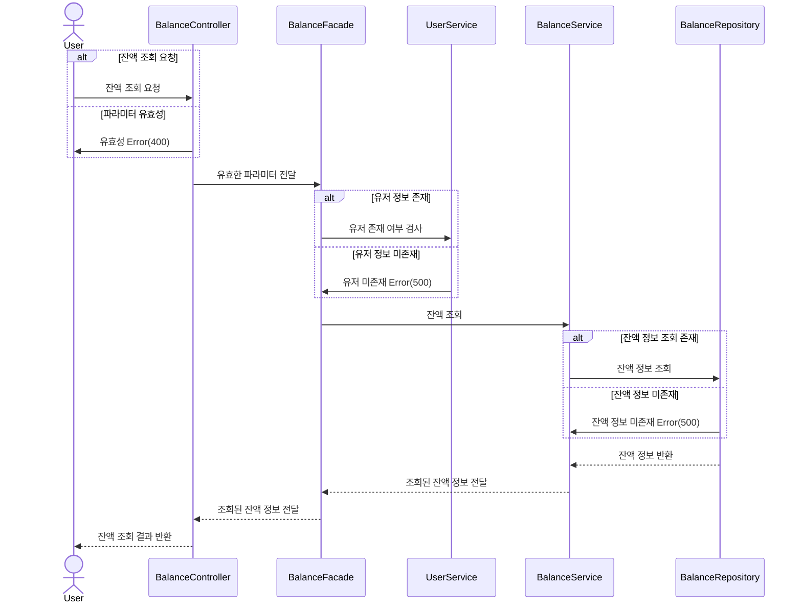
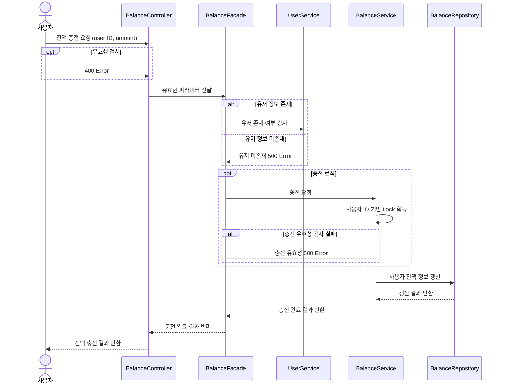
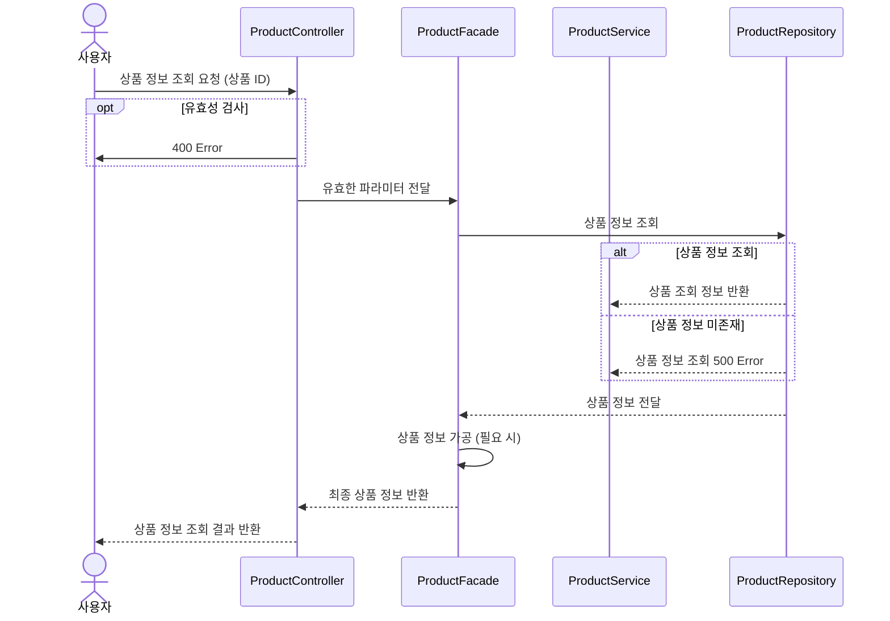
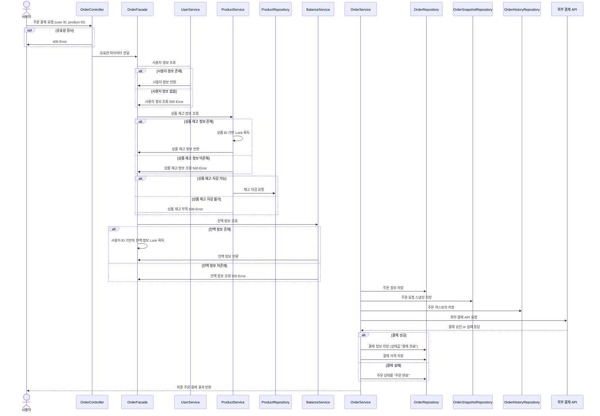

# 🛒 [hhplus] e-commerce 서비스

---
## 💡 프로젝트 개요
- 상품 주문에 필요한 메뉴 정보들을 구성하고 조회가 가능해야 합니다.
- 사용자는 상품을 여러개 선택해 주문할 수 있고, 미리 충전한 잔액을 이용합니다.
- 상품 주문 내역을 통해 판매량이 가장 높은 상품을 추천합니다.

## 🔧 API 요구사항
1️⃣ **`주요`** **잔액 충전 / 조회 API**
- 결제에 사용될 금액을 충전하는 API 를 작성
- 사용자 식별자 및 충전할 금액을 받아 잔액을 충전
- 사용자 식별자를 통해 해당 사용자의 잔액을 조회

2️⃣ **`기본` 상품 조회 API**
- 상품 정보 ( ID, 이름, 가격, 잔여수량 ) 을 조회하는 API 를 작성
- 조회시점의 상품별 잔여수량을 체크하여 정합성을 확보할 것

3️⃣ **`주요`** **주문 / 결제 API**
- 사용자 식별자와 (상품 ID, 수량) 목록을 입력받아 주문하고 결제를 수행하는 API 구현
- 결제는 기 충전된 잔액을 기반으로 수행하며 성공할 시 잔액을 차감해야 한다.
- 데이터 분석을 위해 결제 성공 시에 실시간으로 주문 정보를 데이터 플랫폼에 전송해야 한다.
  ( 데이터 플랫폼이 어플리케이션 `외부` 라는 가정만 지켜 작업할 것 )

4️⃣ **`기본` 상위 상품 조회 API**
- 최근 3일간 가장 많이 팔린 상위 5개 상품 정보를 제공하는 API 구현
- 통계 정보를 다루기 위한 기술적 고민을 충분히 해보기

5️⃣ **`심화` 장바구니 기능**
- 사용자는 구매 이전에 관심 있는 상품들을 장바구니에 적재
- 이 기능을 제공하기 위해 `장바구니에 상품 추가/삭제` API 와 `장바구니 조회` API 가 필요
- 위 두 기능을 제공하기 위해 어떤 요구사항의 비즈니스 로직을 설계해야할 지?

---

## 📅 3주차 ~ 5주차 마일스톤 계획

| **주차** | **작업 내용**                         | **일정**           | **기간 (Days)** | **상태** |
|----------|---------------------------------------|------------------|---------------|----------|
| **3주차**| **요구사항 분석**                     | 10.06 ~ 10.07    | 2             | ✅ 완료  |
|          | **시퀀스 다이어그램 작성**            | 10.08            | 1             | 🔄 진행 중     |
|          | **ERD 분석 및 작성**                  | 10.09            | 1             | 🔄 진행 중     |
|          | **Mock API 개발 및 테스트**           | 10.10 ~ 10.11 오전 | 1.5           | 🔄 진행 중     |
| **4주차**| **잔액 도메인 개발**                  |                  |               | ⏳ 예정     |
|          | - 잔액 조회 API                       | 10.13            | 0.5           | ⏳ 예정     |
|          | - 잔액 조회 API 테스트 코드 작성      | 10.13            | 0.5           | ⏳ 예정     |
|          | - 잔액 충전 API                       | 10.14            | 0.5           | ⏳ 예정     |
|          | - 잔액 충전 API 테스트 코드 작성      | 10.14            | 0.5           | ⏳ 예정     |
|          | **상품 도메인 개발**                  | 10.15            | 1             | ⏳ 예정     |
|          | - 상품 조회 API                       | 10.15            | 0.5           | ⏳ 예정     |
|          | - 상품 조회 API 테스트 코드 작성      | 10.15            | 0.5           | ⏳ 예정     |
|          | **주문 도메인 개발**                  |                  |               | ⏳ 예정     |
|          | - 주문 API                            | 10.16            | 0.5           | ⏳ 예정     |
|          | - 주문 API 테스트 코드 작성           | 10.16            | 0.5           | ⏳ 예정     |
|          | **결제 도메인 개발**                  |                  |               | ⏳ 예정     |
|          | - 결제 API                            | 10.17            | 0.5           | ⏳ 예정     |
|          | - 결제 API 테스트 코드 작성           | 10.17            | 0.5           | ⏳ 예정     |
| **5주차**| **심화 기능 개발**                    |                  |               | ⏳ 예정     |
|          | - 상위 5개 상품 정보 조회 API         | 10.20            | 1             | ⏳ 예정     |
|          | - 장바구니 추가/삭제 API              | 10.21 ~ 10.22    | 2             | ⏳ 예정     |
|          | - 장바구니 조회 API                   | 10.23            | 1             | ⏳ 예정     |
|          | **전반적인 리팩터링**                 | 10.24            | 1             | ⏳ 예정     |

## 📊 Gantt 차트 프로젝트 일정

---

## ⏳ 시퀀스 다이어그램

- ### 잔액 조회

---

- ### 잔액 충전

---

- ### 상품 조회

---

- ### 주문 및 결제
