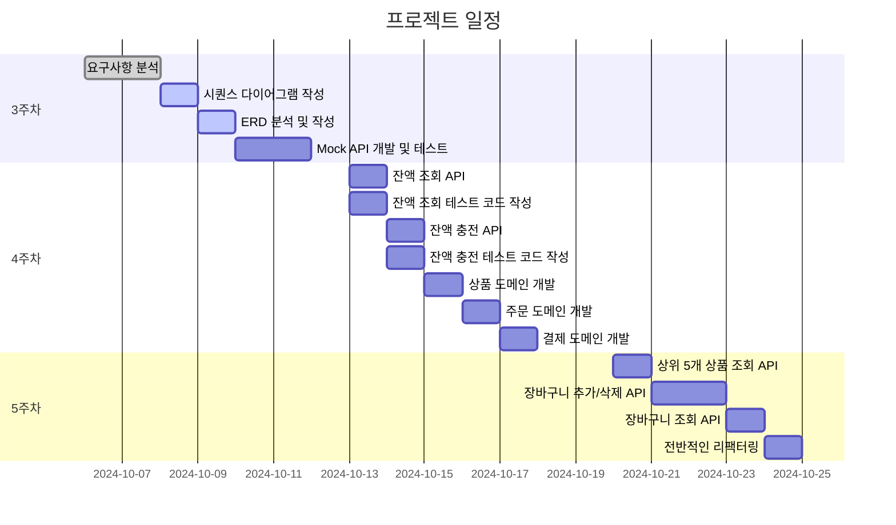

## 📅 3주차 ~ 5주차 마일스톤 계획

| **주차** | **작업 내용**                         | **일정**           | **기간 (Days)** | **상태** |
|----------|---------------------------------------|------------------|---------------|----------|
| **3주차**| **요구사항 분석**                     | 10.06 ~ 10.07    | 2             | ✅ 완료  |
|          | **시퀀스 다이어그램 작성**            | 10.08            | 1             | ✅ 완료     |
|          | **ERD 분석 및 작성**                  | 10.09            | 1             | ✅ 완료     |
|          | **Mock API 개발 및 테스트**           | 10.10 ~ 10.11 오전 | 1.5           | ✅ 완료     |
| **4주차**| **잔액 도메인 개발**                  |                  |               | ⏳ 예정     |
|          | - 잔액 조회 API                       | 10.13            | 0.5           | ⏳ 예정     |
|          | - 잔액 조회 API 테스트 코드 작성      | 10.13            | 0.5           | ⏳ 예정     |
|          | - 잔액 충전 API                       | 10.14            | 0.5           | ⏳ 예정     |
|          | - 잔액 충전 API 테스트 코드 작성      | 10.14            | 0.5           | ⏳ 예정     |
|          | **상품 도메인 개발**                  | 10.15            | 1             | ⏳ 예정     |
|          | - 상품 조회 API                       | 10.15            | 0.5           | ⏳ 예정     |
|          | - 상품 조회 API 테스트 코드 작성      | 10.15            | 0.5           | ⏳ 예정     |
|          | **주문 도메인 개발**                  |                  |               | ⏳ 예정     |
|          | - 주문 API                            | 10.16            | 0.5           | ⏳ 예정     |
|          | - 주문 API 테스트 코드 작성           | 10.16            | 0.5           | ⏳ 예정     |
|          | **결제 도메인 개발**                  |                  |               | ⏳ 예정     |
|          | - 결제 API                            | 10.17            | 0.5           | ⏳ 예정     |
|          | - 결제 API 테스트 코드 작성           | 10.17            | 0.5           | ⏳ 예정     |
| **5주차**| **심화 기능 개발**                    |                  |               | ⏳ 예정     |
|          | - 상위 5개 상품 정보 조회 API         | 10.20            | 1             | ⏳ 예정     |
|          | - 장바구니 추가/삭제 API              | 10.21 ~ 10.22    | 2             | ⏳ 예정     |
|          | - 장바구니 조회 API                   | 10.23            | 1             | ⏳ 예정     |
|          | **전반적인 리팩터링**                 | 10.24            | 1             | ⏳ 예정     |

## 📊 Gantt 차트 프로젝트 일정

