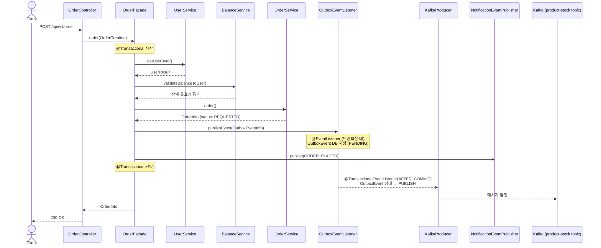
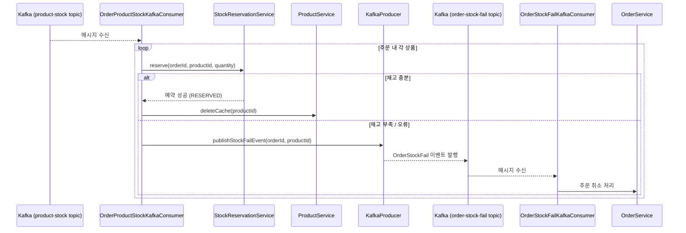
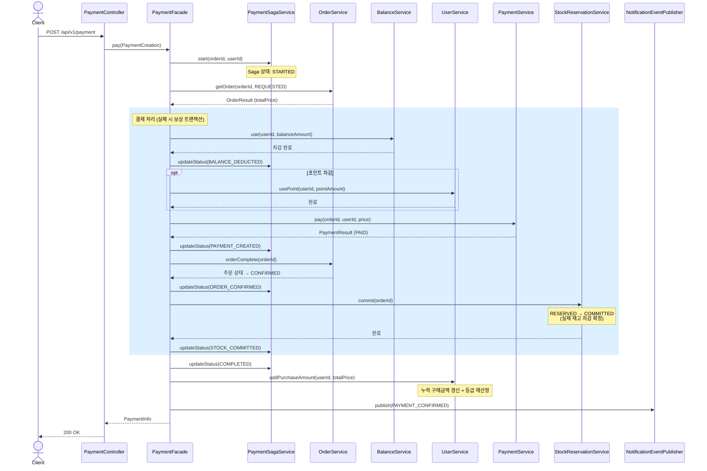
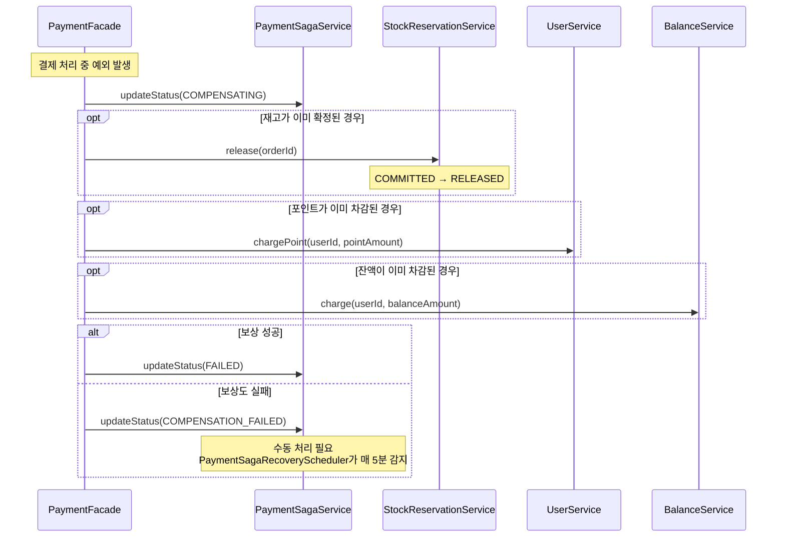
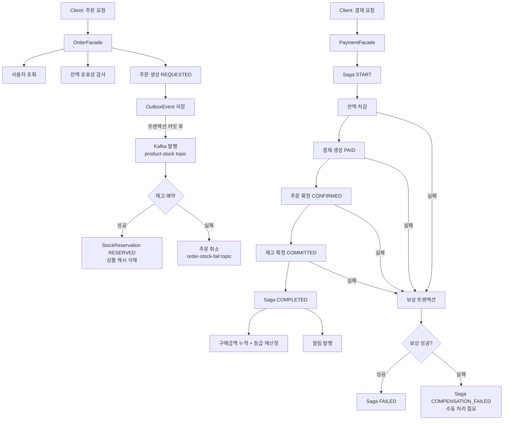

# 주문-결제 서비스 플로우

---

## 1. 주문 플로우

```mermaid
sequenceDiagram
    actor Client

    participant OrderController
    participant OrderFacade
    participant UserService
    participant BalanceService
    participant OrderService
    participant OutboxEventListener
    participant KafkaProducer
    participant NotificationEventPublisher

    participant Kafka as Kafka (product-stock topic)

    Client->>OrderController: POST /api/v1/order
    OrderController->>OrderFacade: order(OrderCreation)

    Note over OrderFacade: @Transactional 시작

    OrderFacade->>UserService: getUserById()
    UserService-->>OrderFacade: UserResult

    OrderFacade->>BalanceService: validateBalanceToUse()
    BalanceService-->>OrderFacade: 잔액 유효성 통과

    OrderFacade->>OrderService: order()
    OrderService-->>OrderFacade: OrderInfo (status: REQUESTED)

    OrderFacade->>OutboxEventListener: publishEvent(OutboxEventInfo)
    Note over OutboxEventListener: @EventListener (트랜잭션 내)<br/>OutboxEvent DB 저장 (PENDING)

    OrderFacade->>NotificationEventPublisher: publish(ORDER_PLACED)

    Note over OrderFacade: @Transactional 커밋

    OutboxEventListener-->>KafkaProducer: @TransactionalEventListener(AFTER_COMMIT)<br/>OutboxEvent 상태 → PUBLISH
    KafkaProducer-->>Kafka: 메시지 발행

    OrderFacade-->>OrderController: OrderInfo
    OrderController-->>Client: 200 OK
```

---

## 2. 재고 예약 플로우 (비동기 - Kafka Consumer)

```mermaid
sequenceDiagram
    participant Kafka as Kafka (product-stock topic)
    participant StockConsumer as OrderProductStockKafkaConsumer
    participant StockReservationService
    participant ProductService
    participant KafkaProducer
    participant FailKafka as Kafka (order-stock-fail topic)
    participant OrderStockFailConsumer as OrderStockFailKafkaConsumer
    participant OrderService

    Kafka-->>StockConsumer: 메시지 수신

    loop 주문 내 각 상품
        StockConsumer->>StockReservationService: reserve(orderId, productId, quantity)

        alt 재고 충분
            StockReservationService-->>StockConsumer: 예약 성공 (RESERVED)
            StockConsumer->>ProductService: deleteCache(productId)
        else 재고 부족 / 오류
            StockConsumer->>KafkaProducer: publishStockFailEvent(orderId, productId)
            KafkaProducer-->>FailKafka: OrderStockFail 이벤트 발행
            FailKafka-->>OrderStockFailConsumer: 메시지 수신
            OrderStockFailConsumer->>OrderService: 주문 취소 처리
        end
    end
```

---

## 3. 결제 플로우

```mermaid
sequenceDiagram
    actor Client

    participant PaymentController
    participant PaymentFacade
    participant PaymentSagaService
    participant OrderService
    participant BalanceService
    participant UserService
    participant PaymentService
    participant StockReservationService
    participant NotificationEventPublisher

    Client->>PaymentController: POST /api/v1/payment
    PaymentController->>PaymentFacade: pay(PaymentCreation)

    PaymentFacade->>PaymentSagaService: start(orderId, userId)
    Note over PaymentSagaService: Saga 상태: STARTED

    PaymentFacade->>OrderService: getOrder(orderId, REQUESTED)
    OrderService-->>PaymentFacade: OrderResult (totalPrice)

    rect rgb(220, 240, 255)
        Note over PaymentFacade: 결제 처리 (실패 시 보상 트랜잭션)

        PaymentFacade->>BalanceService: use(userId, balanceAmount)
        BalanceService-->>PaymentFacade: 차감 완료
        PaymentFacade->>PaymentSagaService: updateStatus(BALANCE_DEDUCTED)

        opt 포인트 차감
            PaymentFacade->>UserService: usePoint(userId, pointAmount)
            UserService-->>PaymentFacade: 완료
        end

        PaymentFacade->>PaymentService: pay(orderId, userId, price)
        PaymentService-->>PaymentFacade: PaymentResult (PAID)
        PaymentFacade->>PaymentSagaService: updateStatus(PAYMENT_CREATED)

        PaymentFacade->>OrderService: orderComplete(orderId)
        OrderService-->>PaymentFacade: 주문 상태 → CONFIRMED
        PaymentFacade->>PaymentSagaService: updateStatus(ORDER_CONFIRMED)

        PaymentFacade->>StockReservationService: commit(orderId)
        Note over StockReservationService: RESERVED → COMMITTED<br/>(실제 재고 차감 확정)
        StockReservationService-->>PaymentFacade: 완료
        PaymentFacade->>PaymentSagaService: updateStatus(STOCK_COMMITTED)
    end

    PaymentFacade->>PaymentSagaService: updateStatus(COMPLETED)
    PaymentFacade->>UserService: addPurchaseAmount(userId, totalPrice)
    Note over UserService: 누적 구매금액 갱신 + 등급 재산정

    PaymentFacade->>NotificationEventPublisher: publish(PAYMENT_CONFIRMED)

    PaymentFacade-->>PaymentController: PaymentInfo
    PaymentController-->>Client: 200 OK
```

---

## 4. 결제 실패 시 보상 트랜잭션 (Saga Compensate)

```mermaid
sequenceDiagram
    participant PaymentFacade
    participant PaymentSagaService
    participant StockReservationService
    participant UserService
    participant BalanceService

    Note over PaymentFacade: 결제 처리 중 예외 발생

    PaymentFacade->>PaymentSagaService: updateStatus(COMPENSATING)

    opt 재고가 이미 확정된 경우
        PaymentFacade->>StockReservationService: release(orderId)
        Note over StockReservationService: COMMITTED → RELEASED
    end

    opt 포인트가 이미 차감된 경우
        PaymentFacade->>UserService: chargePoint(userId, pointAmount)
    end

    opt 잔액이 이미 차감된 경우
        PaymentFacade->>BalanceService: charge(userId, balanceAmount)
    end

    alt 보상 성공
        PaymentFacade->>PaymentSagaService: updateStatus(FAILED)
    else 보상도 실패
        PaymentFacade->>PaymentSagaService: updateStatus(COMPENSATION_FAILED)
        Note over PaymentSagaService: 수동 처리 필요<br/>PaymentSagaRecoveryScheduler가 매 5분 감지
    end
```

---

## 5. 전체 흐름 요약

```mermaid
flowchart TD
    A[Client: 주문 요청] --> B[OrderFacade]
    B --> C[사용자 조회]
    B --> D[잔액 유효성 검사]
    B --> E[주문 생성 REQUESTED]
    E --> F[OutboxEvent 저장]
    F -->|트랜잭션 커밋 후| G[Kafka 발행\nproduct-stock topic]
    G --> H{재고 예약}
    H -->|성공| I[StockReservation RESERVED\n상품 캐시 삭제]
    H -->|실패| J[주문 취소\norder-stock-fail topic]

    K[Client: 결제 요청] --> L[PaymentFacade]
    L --> M[Saga START]
    M --> N[잔액 차감]
    N --> O[결제 생성 PAID]
    O --> P[주문 확정 CONFIRMED]
    P --> Q[재고 확정 COMMITTED]
    Q --> R[Saga COMPLETED]
    R --> S[구매금액 누적 + 등급 재산정]
    R --> T[알림 발행]

    N -->|실패| U[보상 트랜잭션]
    O -->|실패| U
    P -->|실패| U
    Q -->|실패| U
    U --> V{보상 성공?}
    V -->|성공| W[Saga FAILED]
    V -->|실패| X[Saga COMPENSATION_FAILED\n수동 처리 필요]
```
