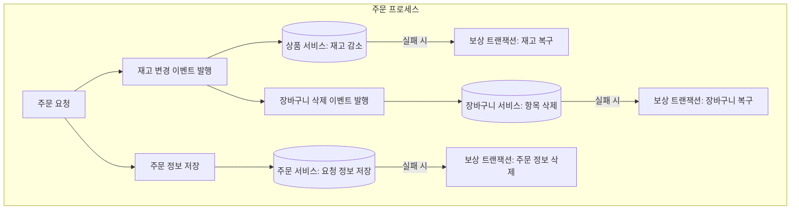
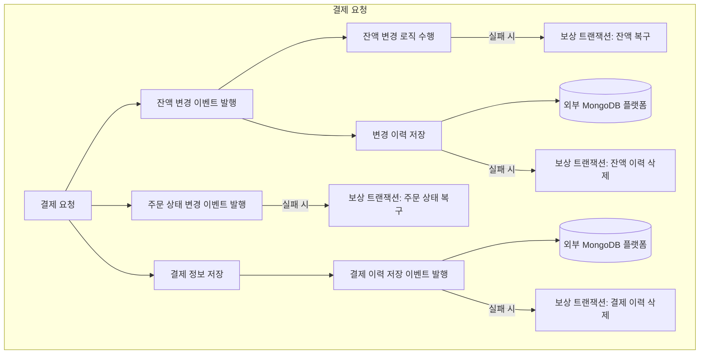

## 서비스 규모 확장에 대한 분석

---
### 트랜잭션 범위 분석
- 주문 프로세스
  - 상품 재고 감소
  - 장바구니 제거
  - 주문 정보 저장
- 결제 프로세스
  - 사용자 잔액 감소
    - 잔액 변경 이력 저장
  - 주문 상태 변경
  - 결제 정보 저장
    - 결제 이력 저장

### 서비스 규모가 확장된다면?
- 현재 구조의 단점
  - 현재 구조에서는 주문/결제 프로세스를 단일 트랜잭션으로 처리할 경우, 각 프로세스가 모든 작업을 완료할 때까지 트랜잭션을 오랫동안 유지해야 하므로 성능과 확장성에 한계가 발생하게 된다.
  - 동기 트랜잭션 처리 시, 하나의 실패로 인해 전체 프로세스가 롤백되어 사용자 경험이 저하될 수 있다.
- 해결 방법
  - 이벤트 드리븐 아키텍처를 적용하여, 주문 및 결제 프로세스를 도메인 별로 나누고 각 도메인이 독립적으로 작업을 수행하도록 하여 트랜잭션 단위를 축소한다.
  - 각 도메인이 이벤트를 발행하고 다른 도메인이 이를 구독하는 방식으로 느슨한 결합을 구현하여, 비동기 처리 및 확장성을 극대화할 수 있다.

---
### 이벤트 드리븐 아키텍처를 구현하기 위한 여러 가지 방법
- **Spring 이벤트 발행**
  - Spring 프레임워크 내에서 사용 가능한 간단한 이벤트 발행 방식으로, 주로 동기적이며 Spring Bean 간의 이벤트 전송에 적합.
- **Kafka 이벤트 발행**
  - 대규모 분산 시스템에 적합한 이벤트 스트리밍 플랫폼으로, 높은 처리량과 내구성을 제공하며 비동기 처리와 데이터 일관성을 보장.
- **RabbitMQ**
  - AMQP 기반의 메시지 브로커로 다양한 라우팅 패턴을 지원하며, 신뢰성이 높고 큐를 통한 메시지 관리가 용이함.
- **Redis Stream**
  - Redis의 인메모리 데이터 구조로 빠른 데이터 처리가 가능하며, 소비자 그룹을 통한 비동기 메시지 분배와 TTL 관리가 용이함.

### 내가 채택할 이벤트 구현 - Kafka
- 채택 이유: 
  - 현재 Step 15에서 Spring Event 기반의 이력 저장에 대한 외부 연동을 진행했었다.
  - 이 번 주제가 `서비스의 규모 확장`인 만큼 분석에 적합한 방식이 Kafkaf라고 생각이 됐는데 그 이유는 다음과 같다.
    - Spring Event는 순서 보장이 되지 않는다. 적어도 같은 Topic(이벤트)에 대해서는 순서가 보장되어야 한다고 생각했다.
    - Kafka의 경우 같은 Topic에 대한 순서 보장이 가능하고, 디스크 기반의 저장 방식으로 메시지 유실이 적다.
    - Kafka의 특징이 `높은 처리량과 내구성 있는 데이터 보존`이라는 점을 미루어 봤을 때, 가장 적합하다고 생각했다.
  - 그럼 왜 RebbitMQ와 Redis Stream은 채택하지 않았나?
    - RebbitMQ의 경우, 유연한 라우팅이 가능하지만 메시지 순서 보장이 복잡하다고 한다. 또한, 초당 처리량이 Kafka보다 낮다고 한다.
    - Redis Stream의 경우, 인메모리 기반의 방식이라 메시지 유실 가능성이 있기 때문에 배제했다.
    - 이 둘은 라우팅 하는 방식이 복잡한 상황이나(RebbitMQ), 짧은 시간 동안 초고속의 인메모리 처리가 필요한 상황(Redis Stream) 등의 서로 다른 목적으로 사용되고, 현재 상황에는 적합하지 않다고 판단하게 되었다. 

### 이벤트 드리븐 과정에서 Fail이 발생할 경우에 대한 보상 트랜잭션 분석
- **SAGA 패턴**
  - **오케스트레이터 패턴**
    - 중앙에서 트랜잭션 흐름을 제어하고 보상 트랜잭션을 관리하는 방식으로, 중앙 서버가 트랜잭션을 관리하여 안정성이 높음.
  - **코레오그래피 패턴**
    - 각 서비스가 독립적으로 이벤트를 발행하고 구독하여 트랜잭션을 수행하며, 실패 시 각 서비스가 스스로 보상 작업을 수행하는 분산 방식.

### 내가 채택할 보상 트랜잭션 - 코레오그래피 패턴
- 채택 이유
  - 오케스트레이터 방식은 중앙 제어 서버가 트랜잭션을 관리하므로 설정과 유지보수가 복잡할 수 있다.
  - 코레오그래피 패턴은 중앙 제어 없이 각 서비스가 이벤트를 발행하고 필요한 보상 작업을 스스로 처리하므로, 단일 장애 지점 없이 트랜잭션이 관리된다.
  - 서비스 확장과 이벤트 제어에 대한 경험을 쌓을 수 있고, 추가 서버 구축이 필요 없다는 장점이 있어 코레오그래피 패턴을 선택했다.

---

### 서비스 도메인 분할 계획
- 사용자 도메인 -> 잔액 관리 및 잔액 이력 관리.
- 상품 도메인 -> 상품 재고와 장바구니 관리.
- 주문 도메인 -> 주문 정보와 주문 상태 관리.
- 결제 도메인 -> 결제 처리와 결제 상태 관리.

### 주문 프로세스에 대한 도메인 분리
- 상품 재고 감소 이벤트 발행
- 장바구니 제거 이벤트 발행
- 주문 상태 변경 이벤트 발행

### 결제 프로세스에 대한 도메인 분리
- 사용자 잔액 차감 이벤트 발행
  - 동시에 잔액 변경 이력 저장 => 외부 MongoDB 플랫폼 연동
- 주문 상태 변경 이벤트 발행
- 결제 상태 변경 이벤트 발행
  - 동시에 결제 이력 저장 => 외부 MongoDB 플랫폼 연동

---

