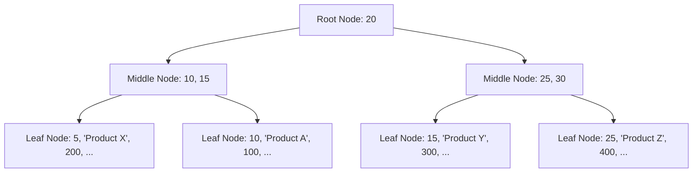

## 부하 테스트 보고서

---

### 대상 선정
- 주문 API
- 상품 조회 API

### 대상 선정 이유
- 주문 API
  - 이머커스의 가장 중요한 부분이고, 병목이 가장 많이 생기는 부분이라 생각해서 해당 API를 대상으로 삼았다.
- 상품 조회 API
  - 사용자가 가장 많이 접근하는 API라고 생각했고, 기존에 캐시를 사용했지만 성능 측정을 위해 DB 조회 기준으로 테스트를 진행했다. 

### 시나리오
- 다수의 사용자가 상품을 조회하거나 주문을 요청하는 시나리오
- 사용자의 요청 간격은 이커머스 특성상 일정하지 않다.
  - 조회의 경우 다양한 간격으로, 테스트 진행
    - 처음 30초 동안은 50명의 사용자가 유입이 되지만,
    - 다음 1분 동안은 사용자가 급증하여 200명의 사용자가 유입이될 수 있다.
  - 주문의 경우 초당 요청을 최대한 높게 잡고 진행 
- 이러한 사용자 유입의 특성을 고려하여, 다양한 구간에서의 성능 측정을 고려했다.

### 테스트 스크립트
- K6 사용
- 사용 이유
  - 사용이 간편하고, JavasScript 코드로 작성하는 부분이 개발자가 제어하기 쉽다고 느껴졌다.
- 사용 예시
  - ```javascript
    export let options = {
        stages: [
            { duration: '30s', target: 100 }, // 30초 동안 100명의 사용자
            { duration: '1m', target: 500 },  // 1분 동안 500명의 사용자
            { duration: '30s', target: 0 },   // 30초 동안 사용자 종료
        ],
    };

    const BASE_URL = 'http://localhost:8080';

    export default function () {
        // DB 조회 엔드포인트
        let dbRes = http.get(`${BASE_URL}/product/db?productId=1`);
        check(dbRes, {
        'DB status is 200': (r) => r.status === 200,
        'DB response time < 400ms': (r) => r.timings.duration < 400,
    });
    
        sleep(1); // 1초 간격으로 반복
    }
    ```

### 부하 테스트 결과
- 상품 조회 API 기준, Spring Warm-UP 전과 후로 max의 지표가 굉장히 많이 달라짐을 느꼈다.
- Warm-UP 전
  - 
- Warm-UP 후
    - 

### Docker 실행 옵션에 따른 성능 비교
  - 이 부분은 테스트 하기가 조금 까다로웠다.
  - 해당 옵션에 대해서는 cpu와 memory를 조정 해 볼 예정인데, JVM에서 사용되는 수치에 따라 적절한 값을 지정해줄 예정이다.


