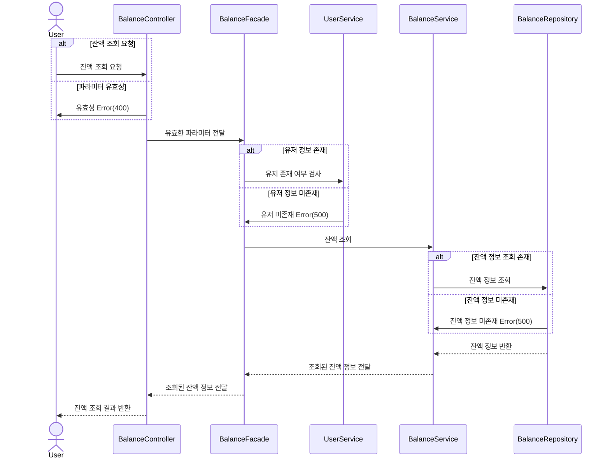
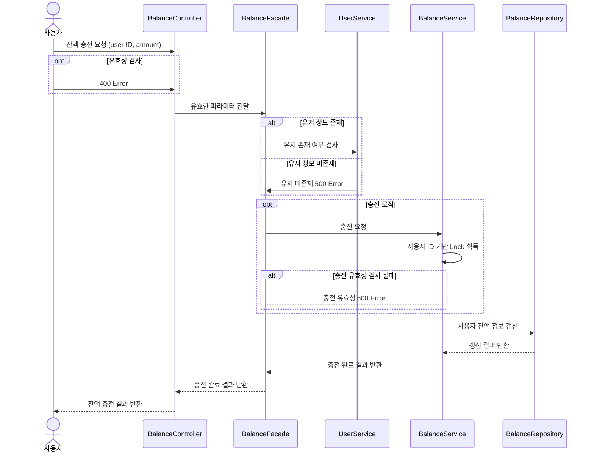
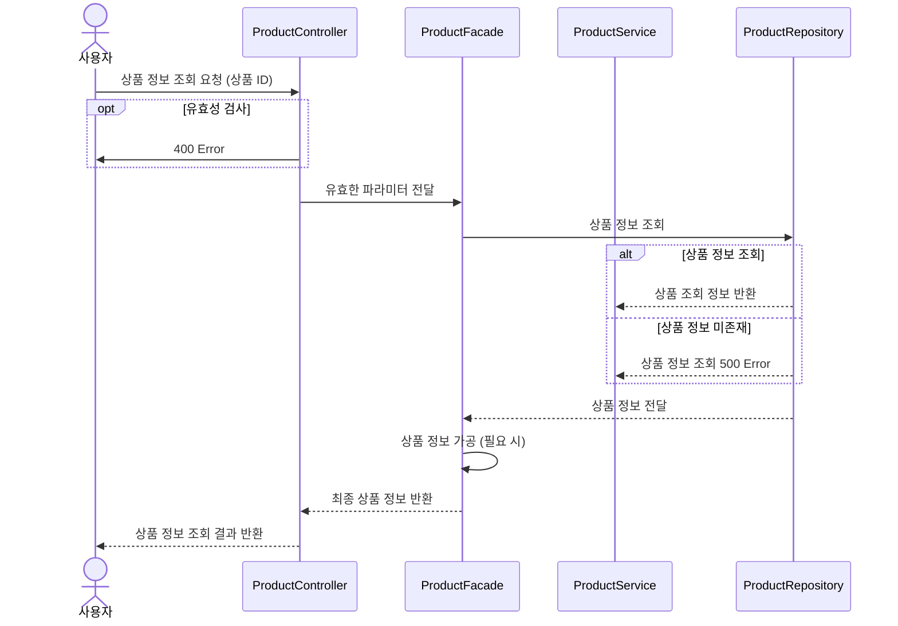
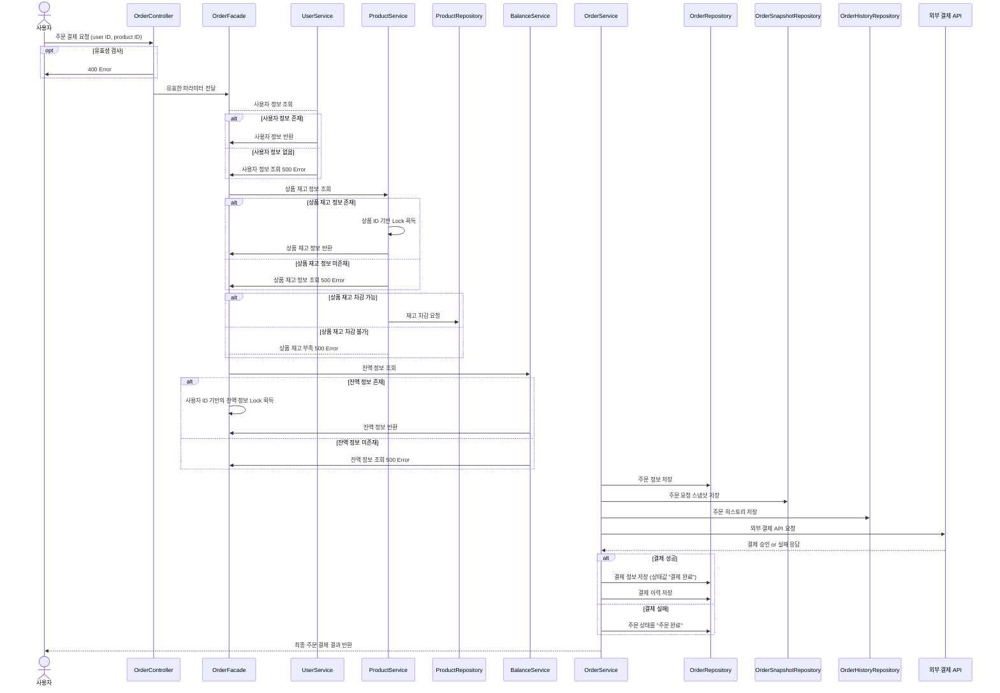

## ⏳ 시퀀스 다이어그램

- ### 잔액 조회

```mermaid
sequenceDiagram
    actor User
    participant BalanceController
    participant BalanceFacade
    participant UserService
    participant BalanceService
    participant BalanceRepository

    alt 잔액 조회 요청
        User->>BalanceController: 잔액 조회 요청
    else 파라미터 유효성
        BalanceController->>User: 유효성 Error(400)
    end
    BalanceController->>BalanceFacade: 유효한 파라미터 전달
    alt 유저 정보 존재
        BalanceFacade->>UserService: 유저 존재 여부 검사
    else 유저 정보 미존재
        UserService->>BalanceFacade: 유저 미존재 Error(500)
    end
    BalanceFacade->>BalanceService: 잔액 조회
    alt 잔액 정보 조회 존재
        BalanceService->>BalanceRepository: 잔액 정보 조회
    else 잔액 정보 미존재
        BalanceRepository->>BalanceService: 잔액 정보 미존재 Error(500)
    end
    BalanceRepository-->>BalanceService: 잔액 정보 반환
    BalanceService-->>BalanceFacade: 조회된 잔액 정보 전달
    BalanceFacade-->>BalanceController: 조회된 잔액 정보 전달
    BalanceController-->>User: 잔액 조회 결과 반환
```

---

- ### 잔액 충전

```mermaid
sequenceDiagram
    actor User as 사용자
    participant BalanceController
    participant BalanceFacade
    participant UserService
    participant BalanceService
    participant BalanceRepository

    User->>BalanceController: 잔액 충전 요청 (user ID, amount)
    opt 유효성 검사
        User->>BalanceController: 400 Error
    end
    BalanceController->>BalanceFacade: 유효한 파라미터 전달
    alt 유저 정보 존재
        BalanceFacade->>UserService: 유저 존재 여부 검사
    else 유저 정보 미존재
        UserService->>BalanceFacade: 유저 미존재 500 Error
    end
    opt 충전 로직
        BalanceFacade->>BalanceService: 충전 요청
        BalanceService->>BalanceService: 사용자 ID 기반 Lock 획득
        alt 충전 유효성 검사 실패
            BalanceService-->BalanceFacade: 충전 유효성 500 Error
        end
    end
    BalanceService->>BalanceRepository: 사용자 잔액 정보 갱신
    BalanceRepository-->>BalanceService: 갱신 결과 반환
    BalanceService-->>BalanceFacade: 충전 완료 결과 반환
    BalanceFacade-->>BalanceController: 충전 완료 결과 반환
    BalanceController-->>User: 잔액 충전 결과 반환
```
---

- ### 상품 조회

```mermaid
sequenceDiagram
    actor User as 사용자
    participant ProductController
    participant ProductFacade
    participant ProductService
    participant ProductRepository

    User->>ProductController: 상품 정보 조회 요청 (상품 ID)
    opt 유효성 검사
        ProductController->>User: 400 Error
    end
    ProductController->>ProductFacade: 유효한 파라미터 전달
    ProductFacade->>ProductRepository: 상품 정보 조회
    alt 상품 정보 조회
        ProductRepository-->>ProductService: 상품 조회 정보 반환
    else 상품 정보 미존재
        ProductRepository-->>ProductService: 상품 정보 조회 500 Error
    end
    ProductRepository-->>ProductFacade: 상품 정보 전달
    ProductFacade->>ProductFacade: 상품 정보 가공 (필요 시)
    ProductFacade-->>ProductController: 최종 상품 정보 반환
    ProductController-->>User: 상품 정보 조회 결과 반환

```
---

- ### 주문 및 결제

```mermaid
sequenceDiagram
    actor User as 사용자
    participant OrderController
    participant OrderFacade
    participant UserService
    participant ProductService
    participant ProductRepository
    participant BalanceService
    participant OrderService

    participant OrderRepository
    participant OrderSnapshotRepository
    participant OrderHistoryRepository
    participant PaymentAPI as 외부 결제 API

    User->>OrderController: 주문 결제 요청 (user ID, product ID)
    opt 유효성 검사
        OrderController->>User: 400 Error
    end
    OrderController->>OrderFacade: 유효한 파라미터 전달
    OrderFacade-->UserService: 사용자 정보 조회
    alt 사용자 정보 존재
        UserService->>OrderFacade: 사용자 정보 반환
    else 사용자 정보 없음
        UserService->>OrderFacade: 사용자 정보 조회 500 Error
    end
    OrderFacade->>ProductService: 상품 재고 정보 조회
    alt 상품 재고 정보 존재
        ProductService->>ProductService: 상품 ID 기반 Lock 획득
        ProductService->>OrderFacade: 상품 재고 정보 반환
    else 상품 재고 정보 미존재
        ProductService->>OrderFacade: 상품 재고 정보 조회 500 Error
    end
    alt 상품 재고 차감 가능
        ProductService->>ProductRepository: 재고 차감 요청
    else 상품 재고 차감 불가
        ProductService --> OrderFacade: 상품 재고 부족 500 Error
    end
    OrderFacade->>BalanceService: 잔액 정보 조회
    alt 잔액 정보 존재
        OrderFacade->>OrderFacade: 사용자 ID 기반의 잔액 정보 Lock 획득
        BalanceService->>OrderFacade: 잔액 정보 반환
    else 잔액 정보 미존재
        BalanceService->>OrderFacade: 잔액 정보 조회 500 Error
    end
    OrderService->>OrderRepository: 주문 정보 저장
    OrderService->>OrderSnapshotRepository: 주문 요청 스냅샷 저장
    OrderService->>OrderHistoryRepository: 주문 히스토리 저장

    OrderService->>PaymentAPI: 외부 결제 API 요청
    PaymentAPI-->>OrderService: 결제 승인 or 실패 응답
    alt 결제 성공
        OrderService->>OrderRepository: 결제 정보 저장 (상태값 "결제 완료")
        OrderService->>OrderRepository: 결제 이력 저장
    else 결제 실패
        OrderService->>OrderRepository: 주문 상태를 "주문 완료"
    end
    OrderService-->>User: 최종 주문 결제 결과 반환

```
